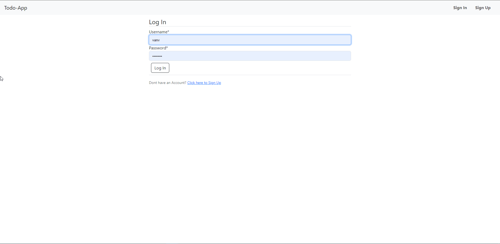
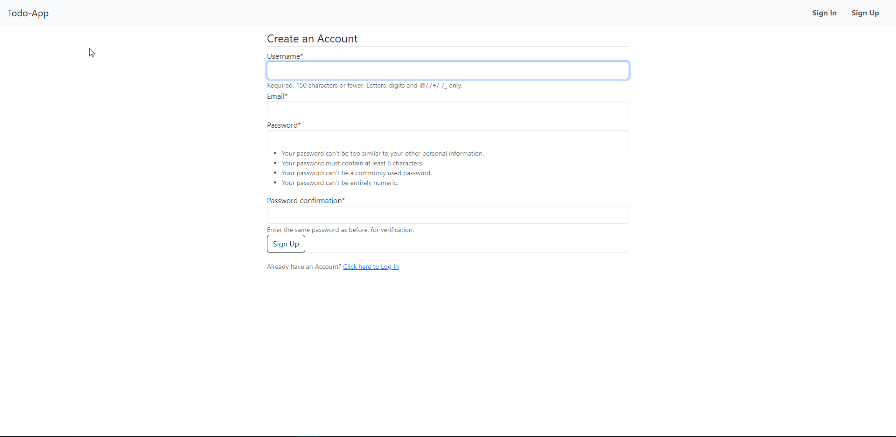
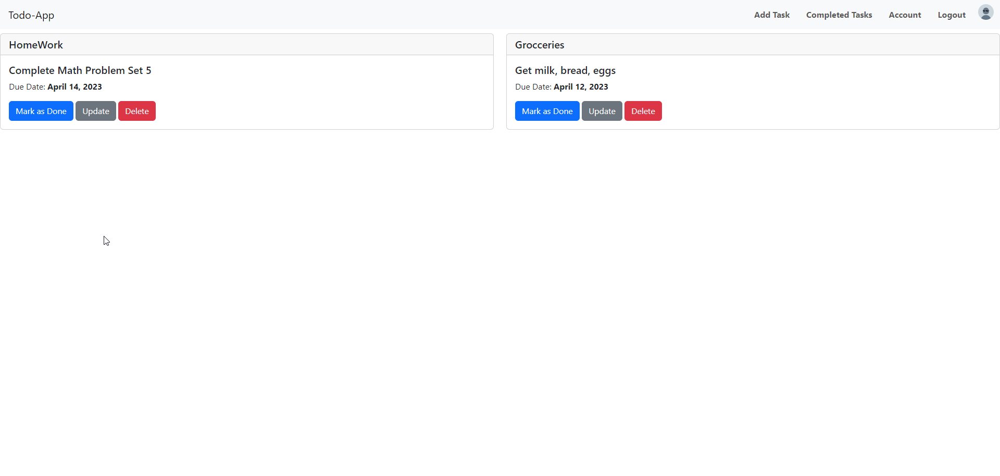
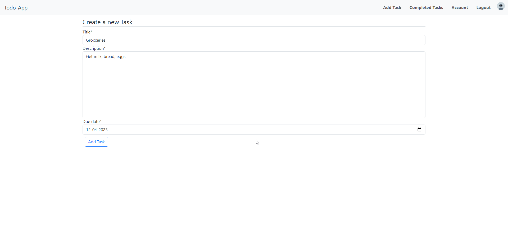
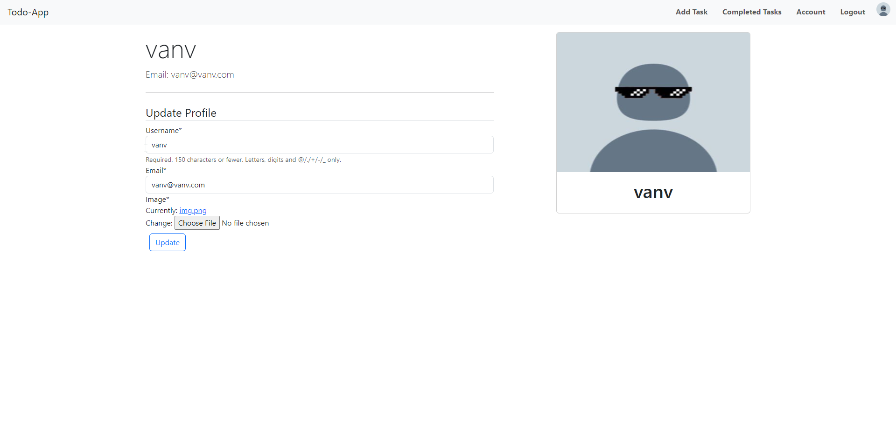
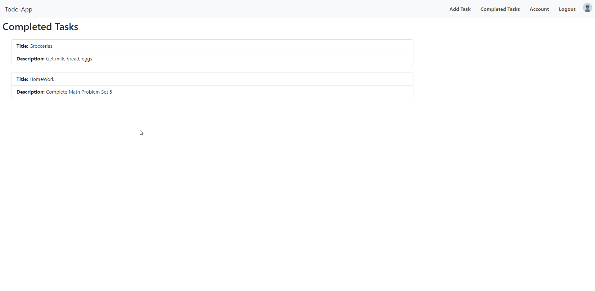

# Todo-App using Django Python

This is a simple Django Todo-List app

The app will be a task manager where users can create, read, update, and delete tasks. Users will also be able to authenticate themselves, view a list of completed tasks, and upload profile pictures.

## Screenshots

<h4>Login Page</h4>

<h4>Sign In Page</h4>

<h4>Home Page</h4>

<h4>Add Task Page</h4>

<h4>Profile Page</h4>

<h4>Completed Task Page</h4>

